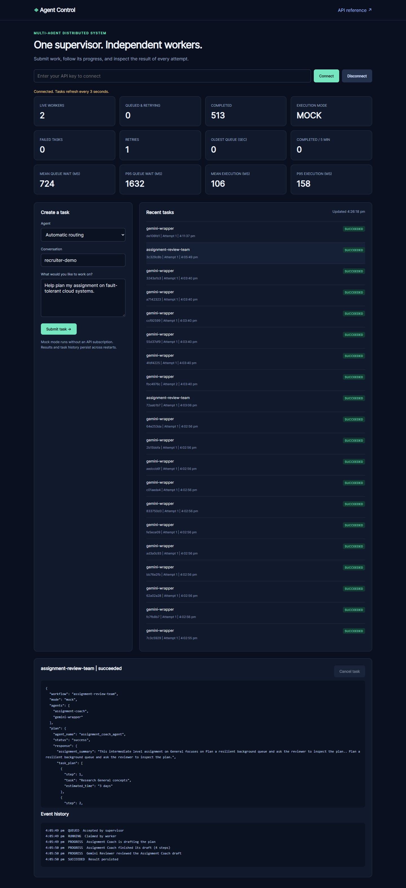
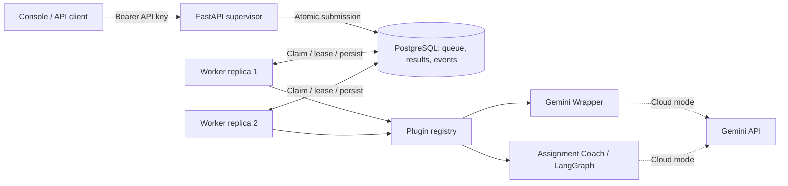

# Multi-Agent Distributed Backend

A cloud-portable task platform built with **FastAPI, Python, Docker, PostgreSQL, SQLite, and LangGraph**. A stateless supervisor accepts authenticated requests; independent workers claim durable jobs, run specialized agents, and persist results.

The included console makes the system easy to demonstrate: submit an assignment, watch its state change, inspect the plan, and review each execution attempt.



**No paid API is needed for the default demo.** Mock mode is explicit and deterministic. Cloud mode calls Gemini for the submitted task.

## Run the demo

Requires Docker Engine with Docker Compose and Python 3.12+.

```bash
python scripts/bootstrap.py
docker compose --env-file .env.cloud up --build --wait --scale worker=2
```

Open **http://localhost:8000**, then connect with the `demo` API key in the generated `.env.cloud`. Select Assignment Coach or use automatic routing and submit an assignment. Open a task to inspect its output and event history.

- Console: http://localhost:8000
- OpenAPI / interactive docs: http://localhost:8000/docs
- Readiness: http://localhost:8000/health/ready

`bootstrap.py` generates random credentials and never overwrites existing configuration. Keep `.env.cloud` private. The console holds the key in browser memory only.

Stop the stack while preserving its database:

```bash
docker compose --env-file .env.cloud down
```

## Architecture



The database is also the queue, avoiding a separate broker in a small deployment. PostgreSQL workers claim rows using `FOR UPDATE SKIP LOCKED`; SQLite uses a serialized write transaction for local development.

| Capability | Implemented behavior |
| --- | --- |
| Distributed execution | Independently scalable worker processes and containers |
| Durable queue | Tasks, results, conversations and lifecycle events survive API restarts |
| Recovery | Expired leases are reclaimed; stale workers cannot overwrite newer attempts |
| Retries | Bounded attempts, exponential delay, terminal `dead` state |
| Idempotency | Per-owner keys suppress duplicate submissions and reject conflicting reuse |
| Authentication | Random bearer API keys mapped to owners; task access scoped to the owner |
| Coordination | Supervisor routes work to plugins; Assignment Coach runs a multi-step planning graph |
| Multi-agent workflow | Assignment Coach drafts a real plan; a reviewer receives and checks that exact plan; each handoff is visible in task history |
| Operations | Liveness/readiness, worker heartbeats, failures, retries, queue age and wait, execution time, and throughput |
| Packaging | Non-root containers, read-only app filesystem, dependency lockfile, CI |
| Demonstration | Browser console and a real-process restart integration test |

Execution is **at least once**. A crashed worker may have already called an external provider before losing its lease. The fencing token protects the persisted result; it cannot undo an external request or its cost.

## Agents

**Gemini Wrapper** generates text in cloud mode and returns a labelled deterministic response in mock mode.

**Assignment Coach** reuses the repository's LangGraph workflow: validate input, summarize the assignment, generate a four-step plan, recommend resources, and provide feedback. Its provider calls are async. Cloud errors propagate to the worker retry policy instead of being presented as mock successes.

**Assignment Review Team** calls Assignment Coach first, then gives its structured plan to Gemini for a second-agent review. Workflow handoffs are saved to the task event history while the worker holds its lease. Mock mode uses an explicitly labelled deterministic reviewer that reads the generated steps and their estimates; it does not pretend to be an LLM evaluation. Cloud mode sends the finished plan to Gemini for a real review.

**Automatic routing** uses explicit keyword rules for assignment-related requests and otherwise selects Gemini Wrapper. It does not claim to perform LLM-based intent classification.

Persistent memory in this runtime means owner-scoped stored requests, results and conversation identifiers. Saved history is available through the API and console; it is not automatically sent to external models. Assignment plans are guidance, not recursively executed sub-jobs.

## API example

Send `Authorization: Bearer <your-key>` on protected routes. Submit:

```http
POST /api/v1/tasks
Idempotency-Key: assignment-demo-001
Content-Type: application/json
```

```json
{
  "agent": "assignment-coach",
  "conversation_id": "cloud-coursework",
  "payload": {
    "assignment_title": "Design a resilient distributed task system",
    "assignment_description": "Explain routing, leases, retries and persistence.",
    "subject": "Cloud Computing"
  }
}
```

The response is `202 Accepted` with a task ID and a `Location` header. Poll that location for the result. An identical idempotency-key replay returns the existing task with `200`; a conflicting request returns `409`.

| Route | Purpose |
| --- | --- |
| `GET /api/v1/agents` | Plugin descriptions and input schemas |
| `POST /api/v1/tasks` | Validate and enqueue work |
| `GET /api/v1/tasks` | Owner-scoped history, optionally filtered by conversation |
| `GET /api/v1/tasks/{id}` | Status and persisted result |
| `GET /api/v1/tasks/{id}/events` | Execution timeline |
| `POST /api/v1/tasks/{id}/cancel` | Cancel queued or running work; discard late results |
| `GET /api/v1/operations` | Owner task counts and live workers |
| `GET /metrics` | Authenticated Prometheus-format queue, worker, retry, failure, throughput, and timing metrics |

## Local Python development

SQLite makes development possible without Docker. Use a virtual environment:

```bash
python -m venv .cloud-venv
# Linux/macOS:
source .cloud-venv/bin/activate
# Windows PowerShell:
# .cloud-venv\Scripts\Activate.ps1
pip install -r requirements-cloud.lock -r requirements-cloud-dev.txt
python scripts/bootstrap.py
python -m cloud.store
```

Run in separate terminals with the environment activated:

```bash
python -m uvicorn cloud.api:app --host 127.0.0.1 --port 8000
python -m cloud.worker
```

Both commands load `.env.cloud`; environment variables take precedence. SQLite is a single-host development option. Use PostgreSQL for multi-host or container replicas.

Run the scripted demo against either deployment:

```bash
python scripts/cloud_demo.py
```

## Measure local load and worker recovery

Keep the stack in mock mode. A repeatable measurement run is:

```bash
python scripts/load_test.py --tasks 100 --clients 12
```

The script records submit latency, tasks per second, submit-to-result p50/p95, database queue-wait p50/p95, and worker execution p50/p95 in JSON. These measurements describe the computer and worker count used for that run. For a more worker-bound comparison, set the same `MOCK_LATENCY_MS=100` for each run (it only delays deterministic mock responses):

```bash
$env:MOCK_LATENCY_MS='100'
docker compose --env-file .env.cloud up -d --no-deps --scale worker=1 --force-recreate worker
Remove-Item Env:MOCK_LATENCY_MS
Start-Sleep -Seconds 35
python scripts/load_test.py --tasks 100 --clients 12 --mock-latency-ms 100 --output docs/benchmarks/workers-1.json

$env:MOCK_LATENCY_MS='100'
docker compose --env-file .env.cloud up -d --no-deps --scale worker=2 --force-recreate worker
Remove-Item Env:MOCK_LATENCY_MS
Start-Sleep -Seconds 35
python scripts/load_test.py --tasks 100 --clients 12 --mock-latency-ms 100 --output docs/benchmarks/workers-2.json
```

The checked-in local sample is summarized in [`docs/benchmarks/README.md`](docs/benchmarks/README.md). It shows the API submit path limiting overall throughput in this small run; the second worker reduced median queue wait, but did not double total throughput.

To kill a real worker while it is handling a task and watch a peer recover the expired lease, run:

```bash
python scripts/worker_failure_demo.py
```

This script requires Docker Compose and at least two running mock workers. It temporarily sets each worker's lease to eight seconds and mock response latency to 2.5 seconds, kills the worker that owns an active task, shows the recovered-attempt event timeline, and restores the previous worker count and worker settings. The API and database keep running. The temporary delay cannot exceed 30 seconds and mock mode does not call Gemini.

## Validation

```bash
python -m pytest tests/cloud -q
python -m ruff check --config ruff-cloud.toml cloud shared/gemini_http.py tests/cloud scripts/bootstrap.py scripts/cloud_demo.py
```

Set `TEST_DATABASE_URL` to a dedicated PostgreSQL database to run the same queue/API tests against PostgreSQL. Those cases explicitly skip when the variable is absent. Tests create uniquely owned records; use an expendable test database.

The suite exercises concurrent submissions and claims, owner isolation, retry exhaustion, worker lease expiry, stale-result fencing, cancellation, adapter behavior, and an actual API restart with two worker processes.

GitHub Actions runs PostgreSQL tests, builds the Docker image, starts two worker containers, and executes the end-to-end demo. The workflow must run on GitHub before its remote status can be claimed.

## Deployment and design notes

- [Validation record](docs/VALIDATION.md)
- [Cloud deployment and operations](docs/CLOUD_DEPLOYMENT.md)
- [Reliability model and tradeoffs](docs/ARCHITECTURE.md)
- [Recruiter demo walkthrough](docs/DEMO.md)

The supported cloud entry point is `cloud.api:app`. This repository focuses on the cloud runtime and the Assignment Coach and Gemini Wrapper agents it uses. New plugins are registered in `cloud/agents.py`.

The load script measures local throughput; it does not claim cloud capacity or a production throughput target. This project has not been deployed to a public cloud account.
