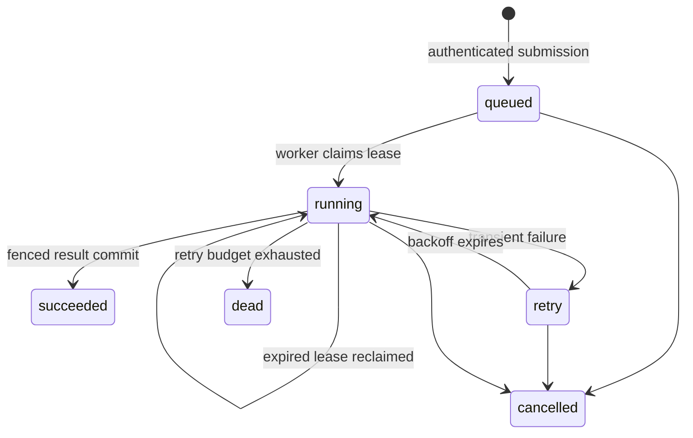

# Architecture and reliability

## Why a database-backed queue?

For a small deployment, PostgreSQL provides persistence, transactions, and competing-consumer coordination in one service. This reduces the number of services to operate. Workers poll with a configurable interval, so the tradeoff is database traffic and polling latency. A dedicated broker may be appropriate when measured throughput requires it.

The supervisor is a logical centralized routing component. Its API processes do not own execution state and can be replicated behind a load balancer.

## Task lifecycle

Claiming work increments its attempt count and assigns an unpredictable lease token. PostgreSQL locks the selected row and skips work already locked by another worker. The transaction commits before calling the agent.

Completion updates are conditional on the job still being running, the token matching, and the lease still being valid. Cancellation clears the token. A process that resumes after losing ownership cannot replace the result of a newer attempt.

The default task timeout is 60 seconds and the lease is 90 seconds. Tasks do not renew leases. Choose a longer timeout and lease together if an agent needs more time; the lease must exceed the timeout. Keep clocks synchronized across hosts. A process or database stall can consume the safety margin and cause a repeated attempt, which is consistent with at-least-once execution.

Expired jobs are recovered when a worker supporting that agent next claims work. Exhausted attempts become dead. A crashed job will remain running until such a worker is available. There is no separate recovery scheduler.

Cancellation stops result acceptance, not an external provider request already in progress. API keys do not identify end-user login sessions; each configured owner is a tenant identity.

## Persistence boundaries

- Submission and its queued event are one transaction.
- Result/state change and completion event are one transaction.
- Per-owner idempotency keys have a database uniqueness constraint.
- Task history includes the submitted payload and output, filtered by owner and conversation.
- Provider calls occur outside database transactions.
- Secrets and prompts are omitted from the cloud runtime's request/worker log records.
- Worker heartbeats are independent of job execution and are used for visibility and container health.

The API readiness endpoint checks database/schema access. Worker availability is reported separately; an API can accept queued work while workers are offline.

## Two-agent Assignment Review Team

The `assignment-review-team` is a parent task executed by one worker. Its first step calls the existing Assignment Coach LangGraph. Its second step gives the resulting structured plan to the Gemini reviewer. The workflow records a progress event before and after each handoff, then stores the final plan and review on the parent job. The parent has the existing job lease and retry behavior, so retrying a failed workflow may run its earlier provider calls again.

Mock mode follows the same two-step handoff, but uses a deterministic reviewer that reads the actual generated steps and estimates. The output is labelled mock and makes no claim that an LLM judged the plan. Cloud mode sends the coach's structured plan to Gemini and stores its review. Saved conversation history is not automatically sent to the model.

Queue wait measures enqueue to the first worker claim. Execution time sums the worker's claimed attempts; time lost while a process is killed or sleeping in retry backoff is intentionally not counted as active execution. The dashboard and `/metrics` show averages and p95 values over the most recent 1,000 completed tasks, plus terminal failures, failed attempts, retry count, pending queue age, and completions in the last five minutes. The load script reports p50 and p95 for its own task IDs so measurements do not include older requests.

## Adding an agent

1. Define a bounded Pydantic input model.
2. Implement an async callable accepting a dictionary and returning JSON-serializable output.
3. Register a `Plugin` in `cloud/agents.py`.
4. Add validation, mock-mode, error, and worker tests.
5. Include its implementation in `Dockerfile.cloud`.

Use `WORKER_AGENTS=assignment-coach` or a comma-separated list to dedicate worker processes to selected plugins. Registry changes require deployment; arbitrary client-supplied imports and URLs are not supported.

Agent functions must not block the event loop. For side effects, pass a task-level deduplication key through to the external service before claiming exactly-once effects.

## Intentional limits

- No priority scheduling, recurring jobs, billing, or multi-region failover.
- No automatic retry of dead tasks; submit a new task with a new idempotency key.
- Schema v1 is bootstrapped by a separate migration command. Future schema changes need versioned migrations before rolling upgrades.
- No automatic deletion policy; set retention/backup policy before storing real user data long term.
- Task input fields are bounded, but a public deployment still needs ingress request-size/rate limits.
- Local mock load figures vary with the test machine and worker count; they are not cloud capacity or availability guarantees.
- API keys are provisioned through configuration; external identity-provider integration is future work.
- Existing experimental agents outside the two registered plugins are not cloud-qualified.

Reference: PostgreSQL documents `SKIP LOCKED` as suitable for avoiding contention among consumers of a queue-like table: [SELECT locking clause](https://www.postgresql.org/docs/current/sql-select.html).
